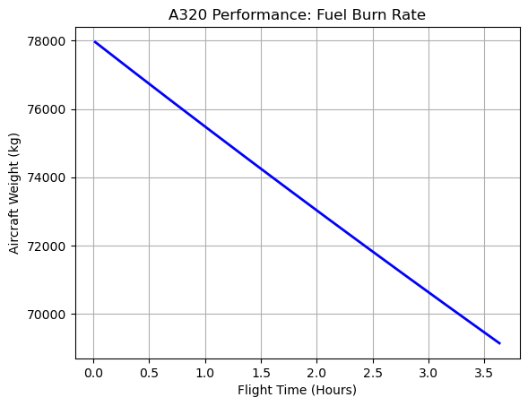

# A320-Flight-Physics-Solver

**Airbus A320 Performance & Mission Profile Solver**

**Overview**
This project is a discrete time-step numerical solver that simulates the dynamic flight physics of an Airbus A320 flying a great-circle route from London Heathrow (LHR) to Mumbai (BOM). The script calculates range, endurance, and fuel burn based on varying payloads and atmospheric conditions

**Core Project Objectives**
* Synthesize aerodynamics, propulsion, and atmospheric physics into a functioning computational model
* Discretize physical equations into numerical solvers to prove scalable, production-grade code architecture
* Generate professional engineering charts to communicate complex performance limits

**Mathematical Baseline & Governing Equations**
The simulation relies on three interconnected physics modules:

1. **Atmospheric Modeling:** Calculates air density ($\rho$), pressure ($P$), and temperature ($T$) at altitude ($h$) using standard ISA equations:
   $T = T_0 + a \cdot h$
   $P = P_0 \left(\frac{T}{T_0}\right)^{-\frac{g}{aR}}$
   $\rho = \frac{P}{RT}$

2. **Aerodynamics & Propulsion:** Derives the required lift coefficient ($C_L$) to maintain steady-state flight, followed by the total drag coefficient ($C_D$) via the parabolic drag polar. Fuel burn is calculated based on the thrust required to overcome instantaneous drag.

3. **Breguet Range Validation:** The 60-second discrete numerical integration is validated against the theoretical Breguet Range Equation to ensure mathematical accuracy:
   $$R = \frac{V}{g \cdot \text{TSFC}} \frac{L}{D} \ln\left(\frac{W_{\text{start}}}{W_{\text{end}}}\right)$$

**Data Visualization**

The solver outputs professional multi-axis engineering charts, proving the efficiency gains of specific mission profiles and demonstrating macro-level flight physics integration[span_5](start_span)[span_5](end_span).

**Usage**
Ensure `atmosphere_model.py`, `aerodynamics.py`, and `propulsion.py` are located in the same directory before executing the main mission loop script.
